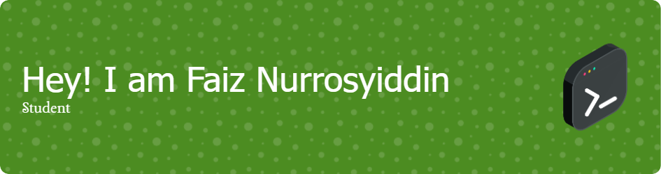

## 💚 Welcome To My Profile 💚
🧑‍🎓 Faiz Nurrosyiddin  
🎓 Informatics Engineering student at Telkom University  
💡 Passionate About Artificial Intellegent  
🔭 I’m currently learning GO, C, Python, Web Dev, MySQL  
📚 Interested in: Machine Learning, Database Design, Cloud Computing  
🌱 Always eager to explore new technologies and contribute to open source projects  
> "Programs must be written for people to read, and only incidentally for machines to execute."  
> — Harold Abelson
## 📫 Lets Connect With ME:)
- Instagram: [@iz_nrsydn](https://www.instagram.com/iz_nrsydn?igsh=MWw4NXgyODRiaGRoNg==)
- LinkedIn: [Faiz Nurrosyiddin](https://www.linkedin.com/in/faiz-nurrosyiddin-5ab658327?utm_source=share&utm_campaign=share_via&utm_content=profile&utm_medium=android_app)
- Email: faiznurrosyiddin2606@gmail.com
## 💻 My Workspace
- **My Laptop:**
 
- **Software:**
 
## 🛠️ Skills
- **Front End:**
 

- **Back End:**
  

<!--
**FaizNrsydn/FaizNrsydn** is a ✨ _special_ ✨ repository because its `README.md` (this file) appears on your GitHub profile.

Here are some ideas to get you started:

- 🔭 I’m currently working on ...
- 🌱 I’m currently learning ...
- 👯 I’m looking to collaborate on ...
- 🤔 I’m looking for help with ...
- 💬 Ask me about ...
- 📫 How to reach me: ...
- 😄 Pronouns: ...
- ⚡ Fun fact: ...
-->
